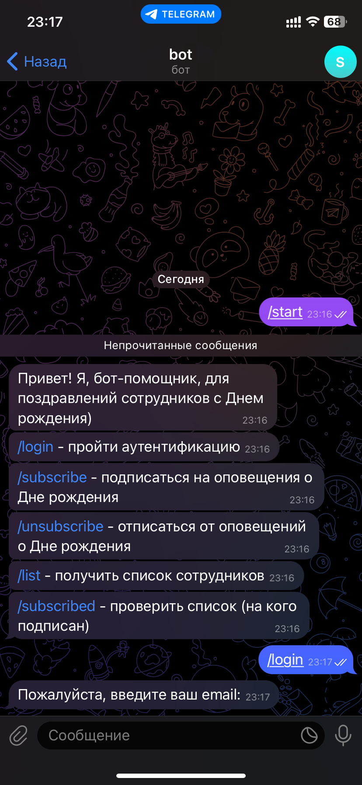

<p align="center">
  <a href="https://gopkg.in/telebot.v3"></a>
  <a href='https://github.com/IlyaStrizh/BirthdayNotificationScheduler/blob/main/migrations/000001_create_employees_table.up.sql'></a>
  <a href='https://github.com/zelenin/go-tdlib?tab=readme-ov-file'></a>	
</p>

# Сервис для поздравлений с Днем рождения
### Внешнее взаимодействие через telegram bot
Заполните .env в ./configs и выполните команды:
```
$ cd deployments && docker-compose  --env-file ../configs/.env up -d && cd -
$ cd cmd && go run main.go
```


Бот дает возможность подписаться/отписаться от оповещения о Дне рождения, создает группу и добавляет в нее всех подписанных.

### Зависимости
[TDlib](https://tdlib.github.io/td/build.html) - corresponds to the commit hash d7203eb

### The MIT License (MIT)
